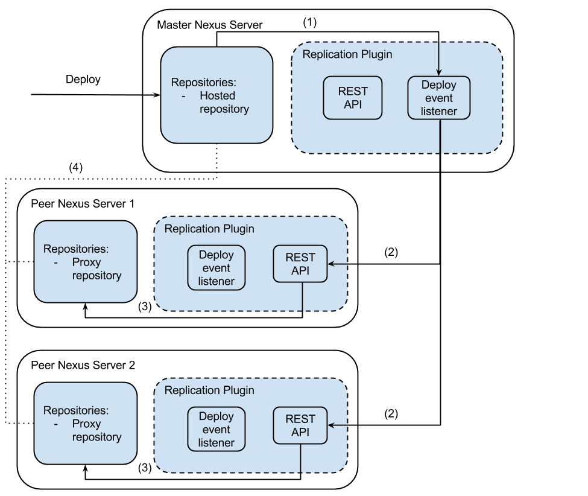

# Nexus Replication Plugin

[https://github.com/griddynamics/nexus-replication-plugin](https://github.com/griddynamics/nexus-replication-plugin)

This is Nexus plugin that provides replication logic when new (Maven) artifacts are stored in a hosted repository. 
Let's say you have 2 or more instances of Nexus. When artifact is uploaded to one of them, that Nexus will send notifications to its peers. Then the Receving Nexuses poll the artifact from the original instance.

## Setting up plugin

See [user documentation](user_doc.md).

## Plugin Architecture



Plugin consists of two main parts:

* [Deploy event listener](https://github.com/griddynamics/nexus-replication-plugin/blob/master/src/main/java/com/griddynamics/cd/nrp/internal/uploading/impl/UploadEventListenerImpl.java)
* [REST API Resource](https://github.com/griddynamics/nexus-replication-plugin/blob/master/src/main/java/com/griddynamics/cd/nrp/internal/rest/ArtifactUpdatePlexusResource.java)

Deploy event listener is registred in [ReplicationPlugin class](https://github.com/griddynamics/nexus-replication-plugin/blob/master/src/main/java/com/griddynamics/cd/nrp/plugin/ReplicationPlugin.java). Event bus executes (1) it when new artifact is received to any hosted repository. Listener [takes peers list from configuration file](https://github.com/griddynamics/nexus-replication-plugin/blob/master/src/main/java/com/griddynamics/cd/nrp/internal/uploading/impl/ConfigurationsManagerImpl.java) and POST HTTP async request (2) to the each peer instanse using [API client](https://github.com/griddynamics/nexus-replication-plugin/blob/master/src/main/java/com/griddynamics/cd/nrp/internal/uploading/impl/ArtifactUpdateApiClientImpl.java).

Plugin REST API is available at `service/local/artifact/maven/update`. This resource receives POST request with a body like this:

```xml
<?xml version="1.0" encoding="UTF-8" standalone="yes"?>
<artifact-meta-info>
    <groupId>com.griddynamics.cd</groupId>
    <artifactId>nexus-replication-plugin</artifactId>
    <version>1.0-20150519.140619-2</version>
    <repositoryId>snapshots</repositoryId>
    <extension>jar</extension>
    <nexusUrl>http://localhost:8081/nexus</nexusUrl>
</artifact-meta-info>
```

When plugin receives replication API request it takes repositories list and filters it by several conditions:

* If repository has proxy type
* If repository proxies remote repository (that received artifact)
* If repository remote URL starts with `nexusUrl`

If all points are true it means that matched repository proxies remote repositoty (Master Nexus repository that received artifact). 
After plugin activates (3) matched repositories to poll artifact.

As soon as artifact pooled (4) API resource returns XML formatted response.
If artifact was resolved successfully response will be:

```xml
<rest-status>
	<isSuccess>true</isSuccess>
	<message>Artifact is resolved.</message>
</rest-status>
```

otherwise `isSuccess` will be false and `message` will contain error description.

